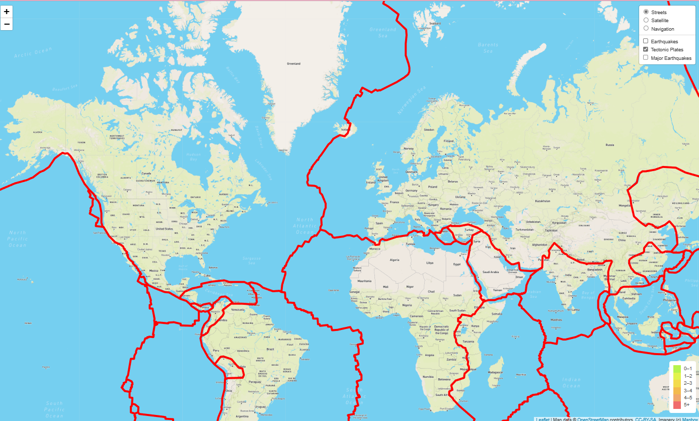

# Mapping_Earthquakes
# Project Overview

In this module, we learned to create interactive maps using GeoJSON data.  Some of the tools used for this work are JavaScript and the D3.js library.  The Leaflet Library was used to plot data on a Mapbox map through an API.  This created the interactivity of the earthquake data.

## *Purpose*
The purpose of this project was to display the earthquake data in relation to the tectonic plates, earthquakes with a magnitude greater than 4.5, and data on a third map of our choice. 

# Results 
To complete this project, graphical coordinates and the magnitude of earthquakes were retrieved from USGS website.  Figure 1 shows a map view of the tectonic plate data and a map with showing earthquakes and the plates.

## *Figure 1*

Next, Figure 2 shows a map view of the major earthquake data and a picture of the map with all three layers. 
## *Figure 2*

The third map, is a view of an additional map type called Navigation
## *Figure 3*

# Summary
Overall, this was a very long project. However, it was fun to layer the map. I would recommend being careful with the branch merging.  It is important to keep track of your work, or it can be lost easily.  I usually keep a backup folder incase i accidently lose everything. 